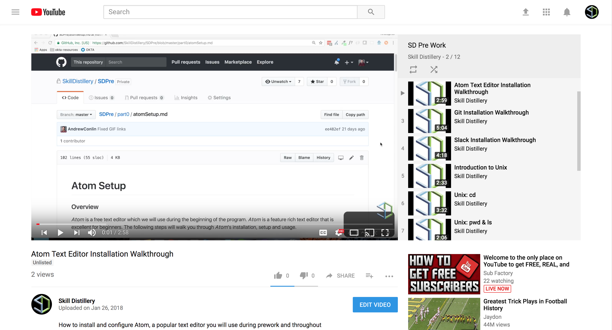
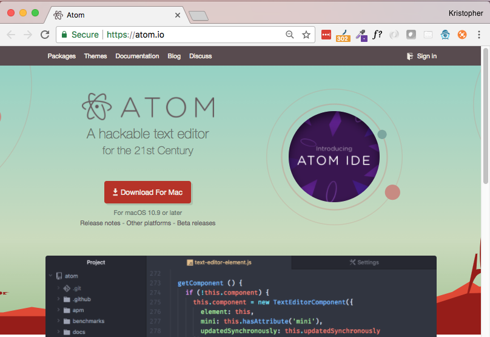
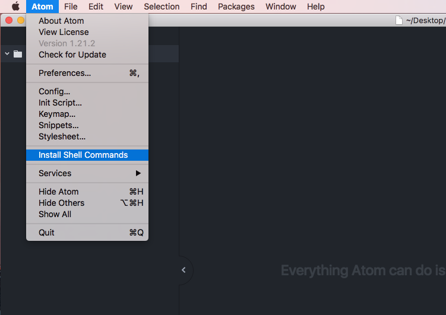
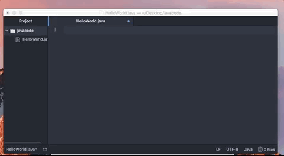

## Atom Setup

##### Overview
_Atom_ is a free programmer's text editor which we will use throughout the program. _Atom_ is a feature rich text editor that is excellent for beginners. The following steps will walk you through _Atom_'s installation, setup and usage.

<hr />

#### Video Guide

<a href="https://youtu.be/gR27yT31GvI">
  
</a>

<hr />

##### 1. Install Atom

* In a browser, go to: https://atom.io/

* Click on the _Download For Mac_ button, this will begin a download of a .zip file that you will use to install _Atom_.



* When the download completes, open _Finder_ and select your _Download_ folder.


* Double click on the `atom-mac.zip` file to extract it's contents.

* Drag the _Atom_ application icon into the _Applications_ folder.


* Open _Atom_ with _Spotlight Search_


<hr>

##### 2. Install Atom's Command Line Tools

_Atom_ has some very useful command line tools that are easy to install. In order to gain access to these tools:

* With _Atom_ open, click on the 'Atom' menu at the top left of your display, then click "Install Shell Commands". On success you should see a confirmation window that the commands were installed.



<hr>

##### 3. Using Atom
We are going to make a directory (folder) on your _Desktop_ named `javacode`. Inside of this directory we are going to create a new file named `HelloWorld.java` and create a simple Java application inside of it. Most exciting of all, we are going to do almost all of this in _Terminal_ using Unix commands.

* In _Terminal_, type `cd ~/Desktop`

  * ***Explanation***: `cd` will _change directory_ to the specified location (in this case, your user's Desktop folder).

* Now that you have navigated to your Desktop, type `mkdir javacode`

  * ***Explanation***: `mkdir` creates a new directory (folder) with the specified name.

* With the `javacode` directory created, you can use `cd javacode` to step into it.


* Now let's create a new file in the directory and open it in _Atom_. When we installed the shell commands for _Atom_ we gained the ability to create and open a file simultaneously. In _Terminal_, type `atom HelloWorld.java`. This will create the file `HelloWorld.java` in the current directory, and open it in _Atom_.


In _Atom_ in the file `HelloWorld.java`, we are going to create a very simple 'Hello World' application to make certain that your environment is configured correctly.

Type the following into the `HelloWorld.java` file.

```java
public class HelloWorld {
  public static void main(String[] args) {
    System.out.println("Hello World");
  }
}
```

* The code above is an extremely simple application that will print out the text `Hello World`. This is an old tradition is software development.



<hr>

##### 4. Compile and Run the Application

Now let's run your application!

* In _Terminal_, type `javac HelloWorld.java`

  * ***Explanation***: `javac` is a compiler that will compile your Java source code down to Java class files containing Java bytecode which can be run on the Java Virtual Machine (JVM). If this doesn't make a ton of sense, don't worry, for now just remember that before you can run your Java applications you have to compile them!

* Now run your application by typing `java HelloWorld`

  * ***Explanation***: The `java` command starts a Java application. It loads a specified class (`HelloWorld` is the name of our class), and calling the class's `main` method (more on this later).


<hr>

#### Hands On

Let's use _Atom_ to create a file named `introToTheTerminal.txt`:

* In _Terminal_, use the following command to go to your _Desktop_:

  ```bash
  cd ~/Desktop
  ```

* Create the file with _Atom_:

  ```bash
  atom introToTheTerminal.txt
  ```

* In _Atom_, type `Hello, Terminal`, then press `command (⌘)` and `s` to save.

* Quit _Atom_.

##### (Optional) 5. Keyboard Shortcuts

If you are interested in learning some of the Keyboard Shortcuts available in the Atom editor, there is an excellent cheatsheet: http://sweetme.at/2014/03/10/atom-editor-cheat-sheet/

<hr>

[Prev](javaInstall.md) | [Up](README.md) | [Next](gitInstall.md)

