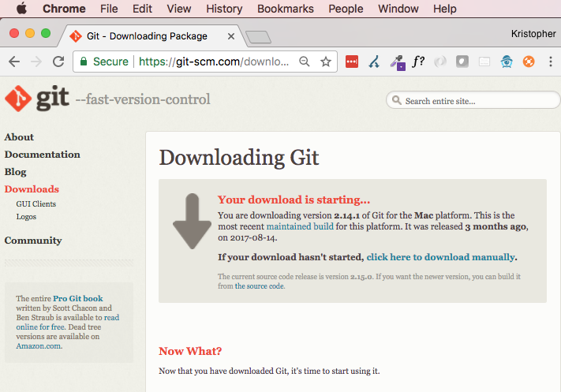
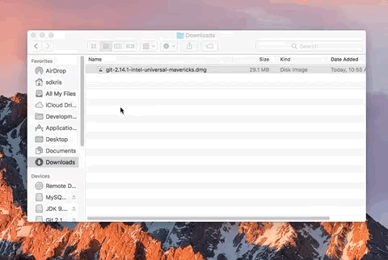
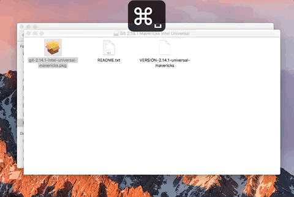

## Git Install

##### Overview
The following is a walkthrough is a guide to install a Version Control Software named _Git_. You will use _Git_ extensively, and subsequent guides will explain how to use/troubleshoot _Git_ more thoroughly.

#### Video Guide

##### 1. Download

* Go to the official Git download page:

https://git-scm.com/downloads

* Click the link under 'Downloads' for _Mac OS X_

* Your download should begin automatically, if it does not, click the "_click here to download manually_" link.

##### 2. Install

* Open _Finder_ and go to your _Downloads_ folder, here there should be a file like *git-2.14.1-intel-universal-mavericks.dmg*.

* Double Click on the *git-2.14.1-intel-universal-mavericks.pkg*

  * You will be met with an error preventing this and warning that the resource is from an unidentified developer.

* Use _Spotlight Search_ to open _System Preferences_.

* Go to _Security & Privacy_ and select the _General_ tab.

* Towards the bottom of the window in the _General_ tab should be a message like : *"git-2.14.1...ericks.pkg" was blocked from opening because it is not from an identified develoer*. This is Apple trying to protect you from potentially malicious software, we know that _Git_ isn't malicious, so we are going to use it anyway.

* Click the _Open Anyway_ button.

* Click the _Open_ button on the window that pops up, this should open the Git installation wizard.

* Use the wizard to install _Git_.

* Click _Continue_

* Click _Install_ (Use the default location)

* Enter the password you use to log into your computer when prompted.

* Verify that _Git_ is installed correctly. In _Terminal_, type `git --version`, you should see a version print out.

##### 3. Configure Git

* Before you start using _Git_ you need to configure it with your name (or an alias) and your email. This should be the email you registered for _Github_ with (or would use to register a new account on _Github_).

* Use _Spotlight Search_ to open _Terminal_.

* Type `git config --global user.name "Your Name"` to enter your name into configuration. ***NOTE***: Obviously, you should put your actual name in the double quotes.

* Now for you email, type `git config --global user.email "your@email.com"`. ***NOTE***: As above, use your actual email within the double quotes.

* You can check to make sure that these values have been configured correctly by typing `git config --global user.name` (which should return your name), and `git config --global user.email` (which should return your email).

[Prev](atomSetup.md) | [Up](README.md) | [Next](slack.md)

