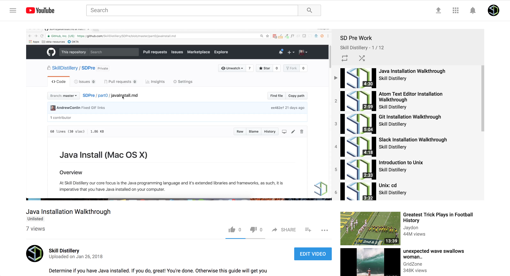
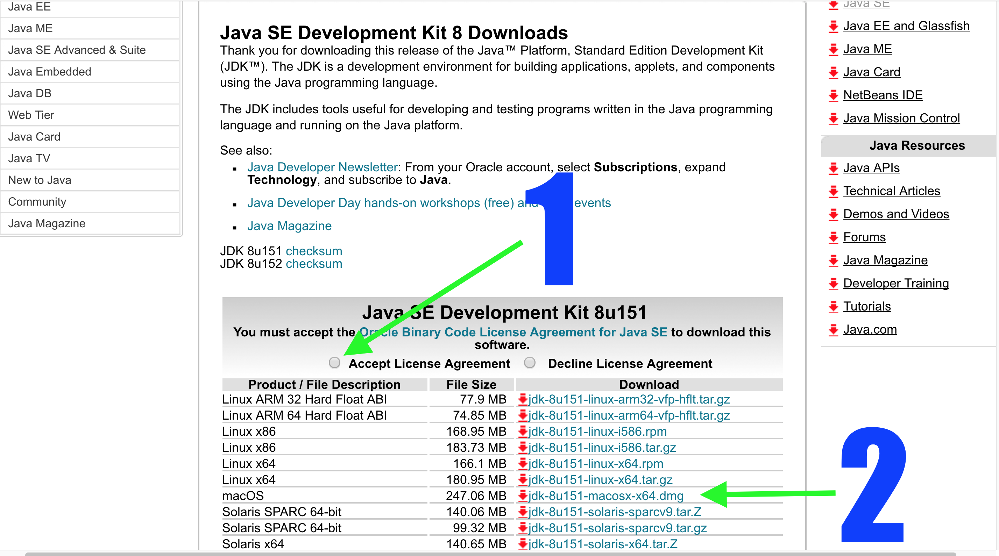

## Java Install (Mac OS X)

### Overview

At Skill Distillery our core focus is the Java programming language and it's extended libraries and frameworks, as such, it is imperative that you have Java installed on your computer.

#### Video Guide

### 1. Download the Java SE Development Kit **8** (JDK)

The  "_Java Platform, Standard Edition Development Kit (JDK)_" contains everything you need to get started with Java.

* Go to Oracle's Java Download site:

http://www.oracle.com/technetwork/java/javase/downloads/jdk8-downloads-2133151.html

  * NOTE: The exact release number may differ from the examples below.  Just make sure you are downloading version **8**, and choose the download at the top of the page.

* (1) Select the "_Accept License Agreement_" radio button

* (2) Click on the macOS download link (this will begin downloading the JDK)

### 2. Install the JDK

In the previous step, you downloaded the _JDK_ in as a _.dmg_ file named something like *jdk-8u151_macosx-x64_bin.dmg*. Now we are going to install the _JDK_ from that file.

* In _Finder_ go to your _Downloads_ folder.

* Double click on the *jdk-8u151_macosx-x64.dmg* file.

  * This will open another window with the Java logo, an open parcel and the words "Java Developer Kit" at the top.

* Double click on the image of the package on the window which opened, this will open an installation wizard.

* Click _Continue_.

* When prompted click _Install_, you will then be prompted to enter your administrative password to complete the installation, this is the same password you use to unlock your computer.

### 3. Check Java Version

* Open _Terminal_ with _Spotlight Search_ (the hotkeys are `command (⌘)` + `SPACE BAR`)

* In the terminal, type `java -version` to see the installed Java version.

* Type `javac -version` to see the installed javac version.

[Prev](README.md) | [Up](README.md) | [Next](atomSetup.md)

