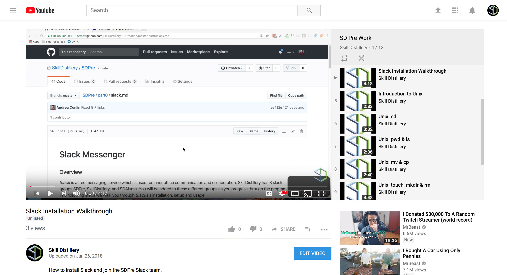
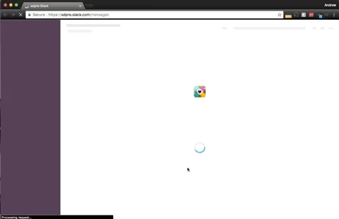
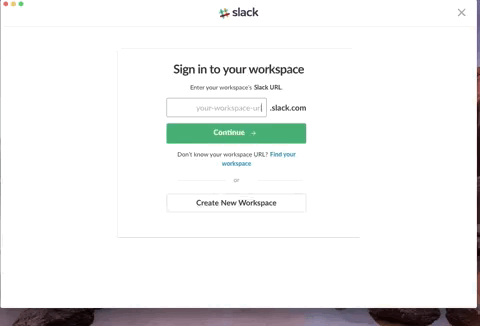
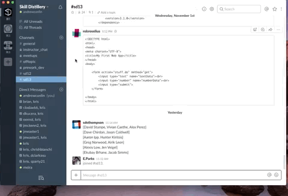

## Slack Messenger

### Overview
_Slack_ is a free messaging service which is used for inter-office communication and collaboration. SkillDistillery has 3 slack workspaces: _SDPre_, _SkillDistillery_, and _SDAlums_. You will be added to these workspaces as you progress through the program. The following steps will walk you through _Slacks_'s installation, setup and usage.

#### Video Guide

### 1. Installing Slack

* In _Spotlight Search_, open the _App Store_.

* Search for the application _Slack_.

* Download the application.

### 2. Joining SDPre Slack Workspace

* Skill Distillery sent an invite to our SDPre slack workspace to the email you provided with your application to the program.  

* Click the `Join Now` button.

* Create an account.

* Accept the customer service agreement. After you do this you will automatically be signed into the web version of Slack.

### 3. Adding a workspace to the Slack App

* Using spotlight search, open the slack app you downloaded.

* Click the add workspace button (`+`).

* Enter `SDPre`.slack.com into the Slack URL.

* Enter the email and password you used when signing up for an account.

* Chat with your classmates!

### Channels

* You are automatically added to the _general_ channel when you join our workspace.

* To join other channels, click on _Channels_ in the left-side menu.

* In the _Browse channels_ window you can see the names and purposes of other channels; to join one, click on it to see a preview, then click _Join Channel_.

[Prev](gitInstall.md) | [Up](README.md)

