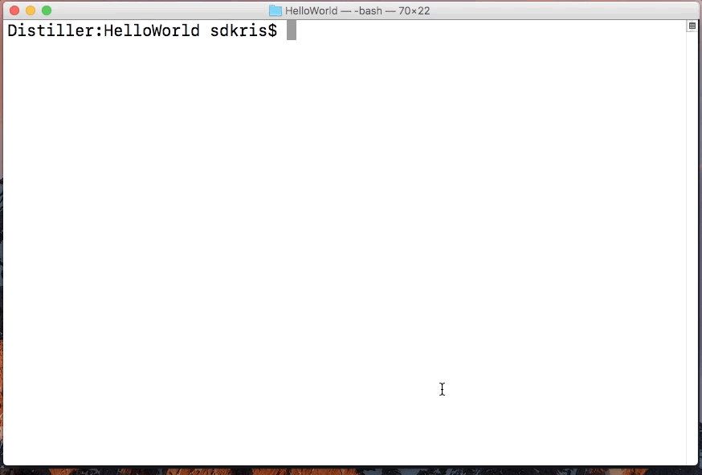
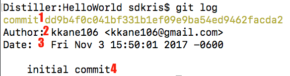

## Version Control With Git

### What is `git`?

`git` is _Version Control_ software which keeps track of the changes you make to files.

Have you ever accidentally deleted something in a _Word_ document, saved and closed it, only to discover your error hours later when it’s too late to fix? Version control solves this problem!

Version control keeps track of your files and remembers all of the changes you've made and when you made them. If you make a mistake, no problem, you can just revert back to a version of your work before that mistake was made.

Instead of tracking each and every time you hit a key like Word does, though, you bundle up all of your changes into something called a _commit_. This set of changes could be anything from changing a typo or fixing a bug to adding a whole new page to a web site.

Developers use version control to keep track of changes in their code, but you can use it for anything. Poets use it to track their poems, businesspeople use it to track their reports – you name it, you can use version control on it! Each commit could be a new stanza, a change to a header, or a whole new feature.

While version control is definitely useful for keeping track of your own files, it becomes more and more important when you are working on the same files with collaborators. Instead of sending a file back and forth to work on it, we can all work on the same files at the same time, then _merge_ all our changes together.

Merging takes commits by two or more people and combines them into a new, complete document. You can fix the first paragraph while I work on the last paragraph and we won’t overwrite one another because we use version control!

Imagine this: you are working on a web app, made up of hundreds of files of code that all work together in a very specific way. Now imagine that there are ten members of your team and each one of them is fixing an issue in a different file. Without version control, team members could overwrite one another’s changes or otherwise accidentally delete all of another team member’s hard work. Version control helps manage that workflow so no one steps on anyone else’s toes, and if something does go wrong you can always just go back to an earlier version.

While there are many different version control systems out there, two popular ones for developers are Subversion (a.k.a. SVN) and Git. They each have their own strengths and weaknesses, but both work great at keeping your changes in line.

The following walkthrough will have you create your first version controlled project with Git!

### 1. Create a Repository

The first step in using `git` with any project is to create a `git` _Repository_. A _Repository_ stores save points in your project called _Commits_, which represent the changes you've made to individual files in your project as well as information about when and why you saved those changes. Don't worry too much about how this all works, `git` will take care of all of the heavy lifting, you just need to tell it how.

To you, a repository will look just like any other folder on your computer (which is true, it's just a folder that `git` is paying attention to).

* Create a folder for your first Version Controlled project to live in:

  * Use _Spotlight Search_ to open _Terminal_.

  * Type `cd ~/Desktop` to change directory to your Desktop folder.

  * Create a directory on in Desktop with the name `HelloWorld` by typing `mkdir HelloWorld`

  * Change directory into your new `HelloWorld` directory with `cd HelloWorld`

  * You can confirm that you are in the right place with `pwd` which is _Print Working Directory_ and the output should end with `/Users/YourUsername/Desktop/HelloWorld`

* Now that you are in your `HelloWorld` folder, we will use a `git` command to initialize it as a _repository_.

  * Type `git init` and press return to initialize the folder as a _repository_

    * This will print the message: `Initialized empty Git repository in /Users/YourUsername/Desktop/HelloWorld/.git/`

  * Now type another command, `git status`, to find out the state of your project.

    * `git status` tells you a number of this:

      * `On branch master` - You are using the 'master' (or main) source of your code.

      * `Initial commit` - You haven't created a _commit_ yet.

      * `nothing to commit` - No files have changed (actually none exist) in this _repository_, and there is nothing to save (_commit_)

### 2. Make a Commit

Now that you have a _repository_ for a project, it's time to create a project! In this section, we will create a simple text file, add some contents to it, and use `git` to save those changes in a _commit_. This is the same process you will repeat over and over again while you work on completing your pre work.

* In you `HelloWorld` folder create a new file name `helloWorld.txt` and open it in _Atom_.

  * First, _change directory_ to your `HelloWorld` directory (if you aren't already there) by typing `ch ~/Desktop/HelloWorld`. You can check your current directory by typing `pwd` in terminal which is _print working directory_.

  * Once in the correct directory, type `atom helloWorld.txt` to create a file with that name and open it in _Atom_ simultaneously.

* Now we will add some text to the file, tell git we want to track those changes, and then _commit_ (save) those changes.

  * Type some text into your `helloWorld.txt` file in _Atom_, then use `command (⌘) + s` to save the changes to the file.

  * Back in terminal, use `git status` to see that git is aware of the file, but lists it as 'Untracked' (which is why it is red).

  * You can now _stage_ the changes to the file by typing `git add helloWorld.txt`. Enter the `git status` command again, and now you will see that the changes to the file are _staged_ (which is why it is green) and will be included in the next _commit_.

* With your files _staged_, you can now create a _commit_ with your changes.

  * To make a _commit_, type `git commit -m "Some commit message"`

    * ***Explanation***: The `-m` flag indicates that you are providing a _commit message_; a _commit messages_ is required for every _commit_. Include a descriptive message between double quotes (`""`) after the `-m`

  * Now type `git log`, this will return a list of all of the _commits_ in you have made.

* Let's take a look at that _commit_

* 1: This is a generated random string of characters and is the unique identifier for this _commit_, think of this as being the _commit's_ name. If you yelled `dd9b4f0c041bf331b1ef09e9ba54ed9462facda2` in a crowded room, this _commit_ would stand up.

* 2: The individual **who** authored the _commit_, if this is incorrect for you, go back to the [Git Installation Walkthrough](../../part0/objective0/gitInstall.md) and check out the section on configuring `git`.

* 3: The timestamp from **when** the _commit_ was authored

* 4: The _commit_ message you included when you committed. These are used as an easy way to determine **why** a _commit_ was made.

### 3. Make Your Project Public on Github

* Continue to [Sharing on Github](pushToGithub.md)

### Glossary

***Commit*** : The sum of changes made to files saved at a specific point in time.

***Repository*** : A folder containing files that `git` is paying attention to. Commits are made within these.

[Prev](gittingStarted.md) | [Up](README.md) | [Next](pushToGithub.md)

