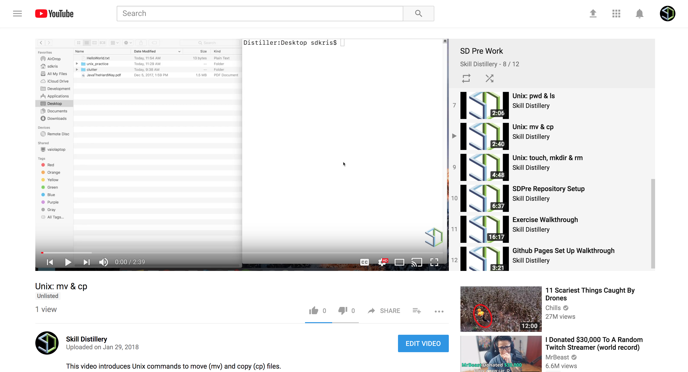

### `mv` and `cp`

#### Video Guide

#### `mv`- *Move (move a file)*

* You are probably used to moving files by dragging and dropping them using _Finder_ or _Windows Explorer_.

  * You can also move files using the terminal with the `mv` command. `mv` takes two arguments, the file or folder you want to move and the location you want to move it to.

  * To move the `introToTheTerminal.txt` file that is in the `notes` directory into the `unix` directory we created with `mkdir`.

  * `mv` can also be used to rename a file. `mv myFile.txt myNewFile.txt` would rename a file called `myFile.txt` as `myNewFile.txt`.

#### `cp`- *Copy (make a copy of a file or directory)*

  * We can create duplicates of a file using the `cp` command. `cp` takes two arguments, the name of the file to copy and the name for the new duplicated file.

  * Lets make a copy of our `introToTheTerminal.txt` file called `introToTheTerminalCopy.txt`

  

[Prev](touch-rm.md) | [Up](README.md) | [Next](touchTyping.md)

