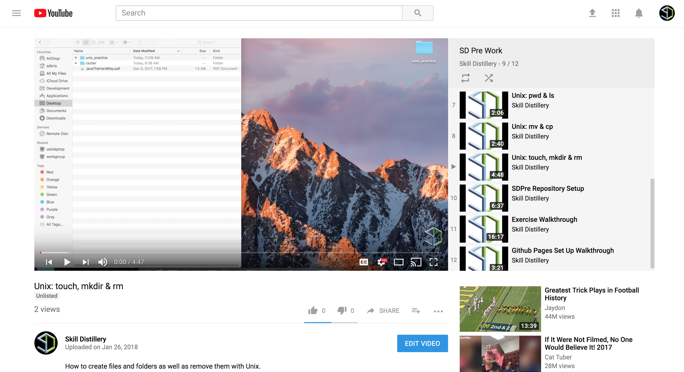

### `touch` and `rm`

<hr />

#### Video Guide

<a href="https://youtu.be/hIVcsKEEB2g">
  
</a>

<hr />

#### `touch`- *Create a file (create a file)*

* After you navigate to the location you want your new file to live, create a new, empty file using the `touch` command, providing the name of the file you want to create:

  ```bash
  touch newFile.txt
  ```


#### `rm`- *Remove (remove a file)*

* Just like we can create files and directories with `touch` and `mkdir`, you can remove them with `rm`.

  * `rm` removes a file, `rmdir` removes an empty directory.

  * To remove a non-empty directory, you need to use an `rm -r`.

    * The `-r` means recursive, which will delete this folder and all of its contents.

* Be **VERY** cautious with `rm`: files are permanently removed as opposed to moved to the _Trash_, and `rm` does not require confirmation.

* Lets delete the `newFile.txt` we created with the `touch` command earlier.


<hr>

[Prev](pwd-ls.md) | [Up](README.md) | [Next](mv-cp.md)

