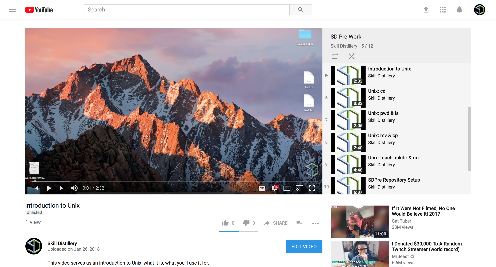

### Using the Terminal

### Overview

_Terminal_ is an application on your Mac that provides a _command line interface_ to your computer's operating system (Mac OS X). By default, Terminal uses a _Unix shell_ named _bash_ to help you configure and modify files on your computer. This _bash_ shell is the same one found on the Unix and Linux systems that typically host web applications.

We will be using _Terminal_ to do things like run applications and create/move/copy files during the program, and the following exercises will begin to acquaint you with this vitally important tool.

#### Video Guide

##### 1. Open Terminal

On Mac OS, the easiest way to locate and open applications is with _Spotlight Search_.

* Press `command (⌘)` + `SPACE BAR` to open _Spotlight Search_.

* Begin typing the name of the application (or file) you wish to open and _Spotlight Search_ will offer recommendations and auto-completion for you. Press return (or click) on the application to open it.

During your time at Skill Distillery, you will be using _Terminal_ extensively.  The Mac OS _Dock_ at the bottom of the desktop holds shortcuts to frequently-used programs.  Add a Dock shortcut for _Terminal_:

* Press `command (⌘)` + `SPACE BAR` to open _Spotlight Search_.
* Start typing `terminal` until `Terminal.app` appears in the list.
* Drag _Terminal.app_ to the dock, making sure to wait for the dock to open a free space between two existing shortcuts, and drop it there to create a shortcut.

##### 2. Check `java` and `javac` Version

Among the most important things you will use _Terminal_ for is to compile and run Java applications. Before going any further, you must ensure that you have Java installed correctly and that `javac` (the program which compiles a Java file) is accessible.

* Click into _Terminal_ and type `java -version`, then press the `RETURN` key. This should return information about the installed version of Java. If your output is similar to the output in the image below, then Java is installed.

* Now type `javac -version` and then press the `RETURN` key. If the output is `javac` followed by a version number, then you are setup and ready to continue.

* ***NOTE***: If either of the preceding commands failed to return a version, you will [need to follow steps to install Java](../part0/javaInstall.md), otherwise, you skip the Java install.

[Prev](terminal.md) | [Up](README.md) | [Next](cd-mkdir.md)

