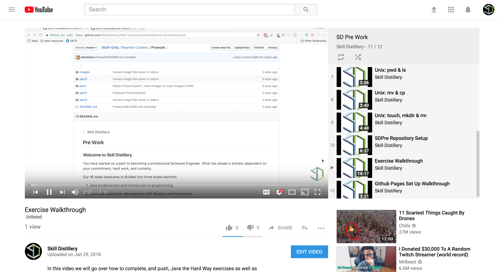

> ##  Skill Distillery

### Setup

#### Creating a Repo on GitHub
We are going to be using _GitHub_ as a way to save, collaborate, and share code throughout the course of the program. To standardize file structure and naming conventions we ask that for the pre work you create a _Github_ repo called 'SDPre'. The video below will walk you through that process.

<hr />

#### Setup Github Repository Video Guide

<a href="https://youtu.be/rmFMzfS6u6o">
  
</a>

Tasks (demonstrated in the video):
* Create Github repository **SDPre** initialized with a _README.md_.
* Copy the  _Clone or Download_ link for the **SDPre** repo.
* Clone the repository into your home directory:
  * Open a terminal.

  ```bash
  cd ~
  git clone https://github.com/YOUR_GITHUB_USERNAME/SDPre.git
  ```

* Go into the cloned working directory and make a change.

  ```bash
  cd ~/SDPre/
  atom .
  ```

  * In the Atom editor, select _README.md_ and add some text:
    
    ```
    ## SDPre

    Hello World
    ```

  * Save the change with _Cmd-S_.

* Push the change to Github.

  ```bash
  git status
  git add README.md
  git status
  git commit -m "hello world"
  git push origin master

* Look at your Github repo to see the changes.

<hr />

#### First Exercise Video Guide!

<a href="https://youtu.be/80u-TyKUuoA">
  
</a>

Tasks (demonstrated in the video):

* Create directories (folders) for Java the Hard Way and Lab exercises.

  ```bash
  cd ~/SDPre/
  pwd
  mkdir JavaTheHardWay
  ls
  mkdir Labs
  ls
  ```

* Create the first program from Java the Hard Way.

  ```bash
  cd JavaTheHardWay/
  touch FirstProg.java
  atom .
  ```

* Type the code shown in the Java the Hard Way material and save the program.

* Compile and run the code.

  ```bash
  javac FirstProg.java
  ls
  java FirstProg
  ````

* Push your work to Github.

  ```bash
  git add FirstProg.java
  git status
  git commit -m "finish jthw ex 1"
  git push origin master
  ```

* Go to the _Labs_ folder and create the first lab program.

  ```bash
  cd ..
  cd Labs/
  pwd
  clear
  touch Objective1Lab1.java
  ls
  atom .
  ```

* Add the starter code from the lab material, and complete the lab.

* Compile and run your program.

  ```bash
  javac Objective1Lab1.java
  java Objective1Lab1
  ```

* Push your work to Github.

  ```bash
  git add Objective1Lab1.java
  git status
  git commit -m "complete objective1lab1"
  git push origin master
  ```

<hr />

### Setting up your file structure

* You will create a local repository named _SDPre_ under your HOME directory for this work, and initialize it as a _Git_ repository.

* Your file structure should look like this as you start making your way through the JavaTheHardWay and subsequent lab materials.

  * As you make your way through the JavaTheHardWay exercises create the _.java_ file inside of a folder called _JavaTheHardWay_.

  * For the objective labs, within a _Labs_ folder, create the _.java_ file in accordance to the instructions.

```bash
HOME
   SDPre
   ├── JavaTheHardWay
   │   ├── FirstProg.java
   │   ├── LetterToYourself.java
   │   ├── PrintingChoices.java
   │   └── ...
   └── Labs
       ├── Objective1Lab1.java
       ├── Objective1Lab2.java
       ├── Objective1Lab3.java
       └── ...
```

<hr>

[Prev](objective7-README.md) | [Up](README.md) | [Next](objective1-README.md)

