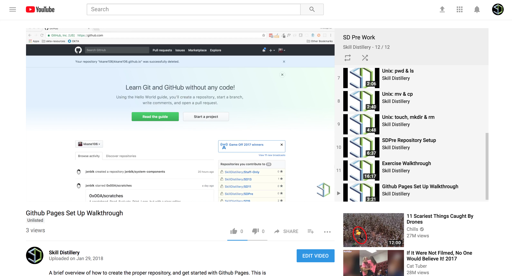

## Github Pages

### Overview

Github Pages is a free service that is available to those with Github accounts which allows you to publish HTML content through their servers. You can think of this as an easy to navigate, and free hosting service for the blog you just created.

The following instructions will help guide you through the setup of Github Pages and let you share you blog on the web.

<hr>

### Setup
The official setup instructions for Github Pages are a little sparse on details, and are located here: https://pages.github.com/

<hr />

#### Setup Github Pages Guide

<a href="https://youtu.be/Q2uJjE19yZ8">
  
</a>

<hr />

The following will be a bit more of a step by step guide:

***Step 1: Create a repository***

* By default a repository named `YourUsername.github.io` will be configured as a Github Pages site (it is possible to use other repositories, but we are starting with the easiest path to success).

* Login to Github, and from your profile, create a new *Repository* named `YourUsername.github.io` (where `YourUsername` is your actual username).

***Step 2: Clone the repository to your Desktop***

* Open *Terminal*

* Change directory (`cd`) to your Desktop `cd ~/Desktop`

* Now clone the repository you just created to your Desktop:

`git clone https://github.com/YourUsername.github.io`

  * ***NOTE***: As above, `YourUsername` should be your actual username

* This will create a directory on your Desktop named `YourUsername.github.io`, this is a *local repository*, files and changes made in here can be committed and pushed to the *remote repository* (the one on Github). Any files and changes made will be available on the web at http://YourUsername.github.io.

  * ***Example:***

    * I make a file like the one below named `home.html`

```html
<!DOCTYPE html>
<html>
  <head>
    <title>Home</title>
  </head>
  <body>
    <h1>Home</h1>
    <p>Welcome to my sweet home page.</p>
  </body>
</html>
```

    * This page will be available at http://MyUsername.github.io/home.html

***Step 3: Move Your Blog Files***

You should have completed the *Start Blogging* task by now. If you have, then you already have some kind of HTML blog built. Use `mv` or `cp` to move or copy your blog files into this `MyUsername.github.io` repository (the one you just cloned), then use *Git* to `add`, `commit` and `push` you files. This will make them available from your Github Pages site.

<hr>


### Bonus! Show Off!

Now that you've setup your blog on Github Pages you can share it with anyone you want. Why not start by posting a link in Slack so that your classmates can see what you've done.

<hr>

[Prev](startBlogging.md) | [Up](README.md)

