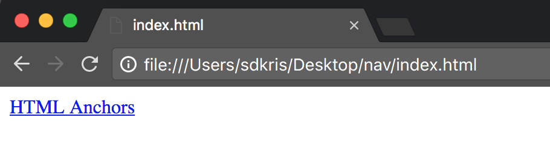
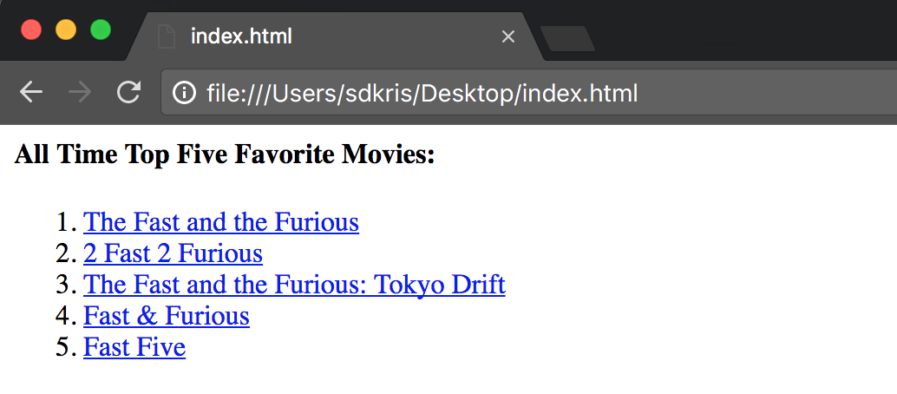

## Links

It is frequently useful to be able to link to other resources on the web. These could be resources that you have provided such as images or files that you created, or they could be files, images, or web pages that are hosted elsewhere (for instance linking to a Wikipedia article).

To link to an external resource we use the _anchor_ element `<a></a>`.

Any text between the _anchor_ tags will take on some default styling, notable it's text will be blue and it will be underlined.

The _anchor_ itself will format the surrounded text, in order for it to actually link to a resource, you need to provide the location of that resource to an `href` attribute of the _anchor_.

The following is a link to the W3Schools article on _anchor_ tags:

```html
<a href="https://www.w3schools.com/tags/tag_a.asp">HTML Anchors</a>
```

Which renders:



<hr>

### Linking to External Resources

Below is an example of how you could use several _anchor_ links within an ordered list to link to external sites.

```html
<h4>All Time Top Five Favorite Movies:</h4>

<ol>
  <li>
    <a href="http://www.imdb.com/title/tt0232500/">The Fast and the Furious</a>
  </li>
  <li>
    <a href="http://www.imdb.com/title/tt0322259/">2 Fast 2 Furious</a>
  </li>
  <li>
    <a href="http://www.imdb.com/title/tt0463985/">The Fast and the Furious: Tokyo Drift</a>
  </li>
  <li>
    <a href="http://www.imdb.com/title/tt1013752/">Fast & Furious</a>
  </li>
  <li>
    <a href="http://www.imdb.com/title/tt1596343/">Fast Five</a>
  </li>
</ol>
```

Which renders as:



<hr>

### Linking to Files in Directories

When creating your own static website (as you will with your blog), it is useful to link to your own files as part of your site's navigation.

The following is an extremely simple list of site locations available for a user to navigate to:


Each of the links above navigates to a local HTML file hosted within the same file system as the html file displaying the links. The file with these links is 'index.html', the other files in the file system as below:

```bash
├── home.html
├── index.html # the file above
└── pages
    ├── about.html
    └── contact.html
```

As you can see, the 'home.html' file is in the same directory level as the 'index.html', while the 'about.html' and 'contact.html' files are nested within a 'pages' directory.

To access each of these resources from my 'index.html' file I must provide their _relative paths_ to the `href` attribute of the _anchor_ tag. A _relative path_ is the set of instructions to navigate from the current location (the file the path appears in) to the referenced location.

Here is how you would link to each of those files from 'index.html':

```html
<!-- index.html -->
<ul>
  <li>
    <a href="home.html">Home</a>
  </li>
  <li>
    <a href="pages/about.html">About</a>
  </li>
  <li>
    <a href="pages/contact.html">Contact</a>
  </li>
</ul>
```

* The 'home.html' file is located in the same directory as 'index.html', because of this, you can link to the file directly `<a href="home.html">Home</a>`

* 'about.html' and 'contact.html' are both in a 'pages' directory nested one level deeper than 'index.html', as a result, you must path to these files through that nested directory : `<a href="pages/about.html">About</a>`

> ###  Skill Drill
> * ***NOTE:*** This drill continues the work you started in the previous hands on and will build upon those files.
>
> 0. Open the `index.html` document in your `SDPre/Blog` directory.
> 1. Add a external link on your page that links to your Github personal account. One for Skill Distillery would look something like this: `<a href="https://github.com/SkillDistillery">Skill Distillery Github</a>`
> 2. From finder, right click (2 finger click ***or*** ctrl + click) on the `index.html`, select 'Open With' and click on your favorite browser (we recommend Chrome).
> 3. Take a look at the updates you have made to the page.

<hr>

[Prev](lists.md) | [Up](README.md) | [Next](images.md)

