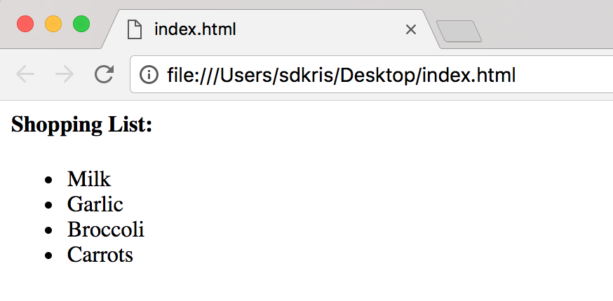
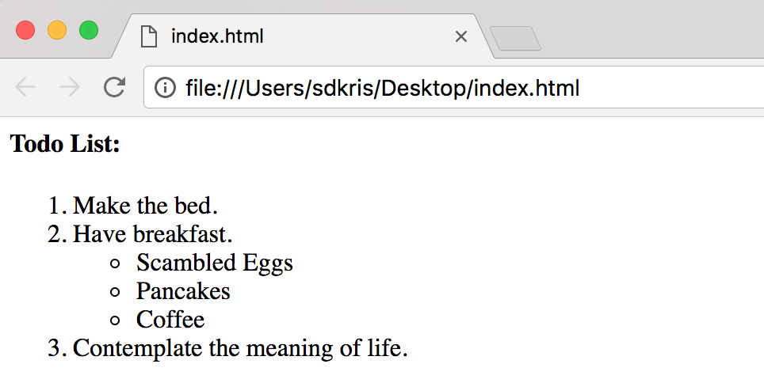

## HTML Lists

There are two types of lists, *Unordered Lists* (`<ul>`), which use bullet points to the list of defined *List Items* (`<li>`), and *Ordered Lists* (`<ol>`), which use numbers.

### Unordered Lists (`<ul>`)

```html
<h4>Shopping List:</h4>

<ul>
  <li>Milk</li>
  <li>Garlic</li>
  <li>Broccoli</li>
  <li>Carrots</li>
</ul>
```



<hr>

### Ordered Lists (`<ol>`)
```html
<h4>All Time Top Five Favorite Movies:</h4>

<ol>
  <li>The Fast and the Furious</li>
  <li>2 Fast 2 Furious</li>
  <li>The Fast and the Furious: Tokyo Drift</li>
  <li>Fast & Furious</li>
  <li>Fast Five</li>
</ol>
```


<hr>

### Nested Lists
```html
<h4>Todo List:</h4>

<ol>
  <li>Make the bed.</li>
  <li>Have breakfast.</li>
  <ul>
    <li>Scambled Eggs</li>
    <li>Pancakes</li>
    <li>Coffee</li>
  </ul>
  <li>Contemplate the meaning of life.</li>
</ol>
```



<hr>

> ###  Skill Drill
> * ***NOTE:*** This drill continues the work you started in the previous hands on and will build upon those files.
>
> 0. Open the `index.html` document in your `SDPre/Blog` directory.
> 1. Add an ordered list `<ol>` to the `<body>` of your document that lists your 4 favorite movies.
> 2. From finder, right click (2 finger click ***or*** ctrl + click) on the `index.html`, select 'Open With' and click on your favorite browser (we recommend Chrome).
> 3. Take a look at the updates you have made to the page.

<hr>

[Prev](basicFormatting.md) | [Up](README.md) | [Next](links.md)

